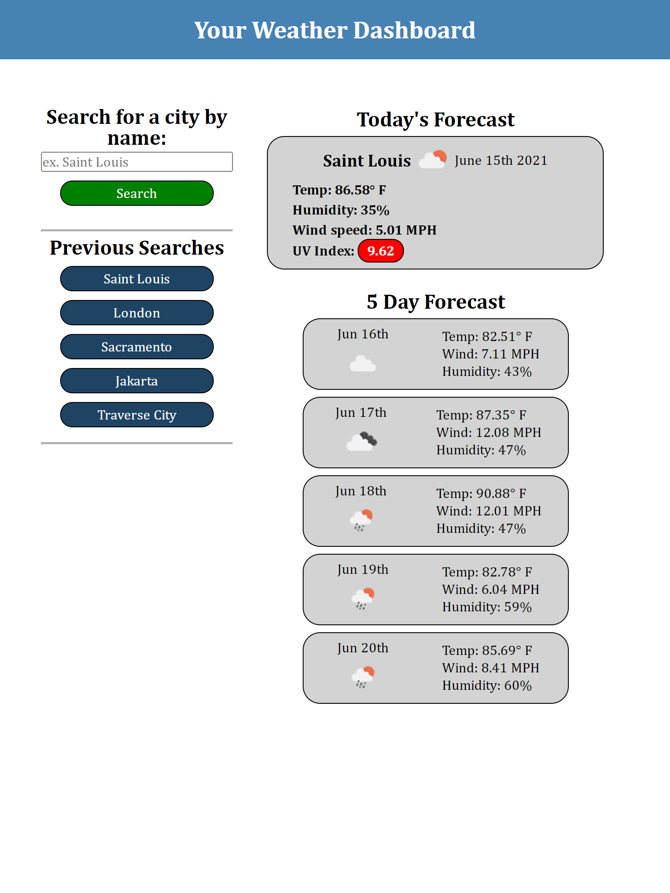

# WashU Bootcamp Homework, Week Six

## Table of Contents

I. Description
II. Project screenshot
III. Link to deployed page

## I. Description

Week six homework.  
Creating a weather application using the provided mock-up and Acceptance Criteria.
Creating a repository on Github, and deploy the page to a live URL.
Acceptance Criteria include:
Searching for a city returns current weather which includes city name, date, a weather icon of current conditions, the temp, humidity, wind speed, and the UV index.
The UV index should be color coded to the severity of the rating.
This search should also give a 5 day forecast that displays the date, a weather icon of expected conditions, the temp, humidity, and wind speed.
Search history should also be displayed, clicking a past search should refresh the weather for that location.

## II. Project screenshot

## III. Link to deployed page

https://mikechampion.github.io/weather-app/
